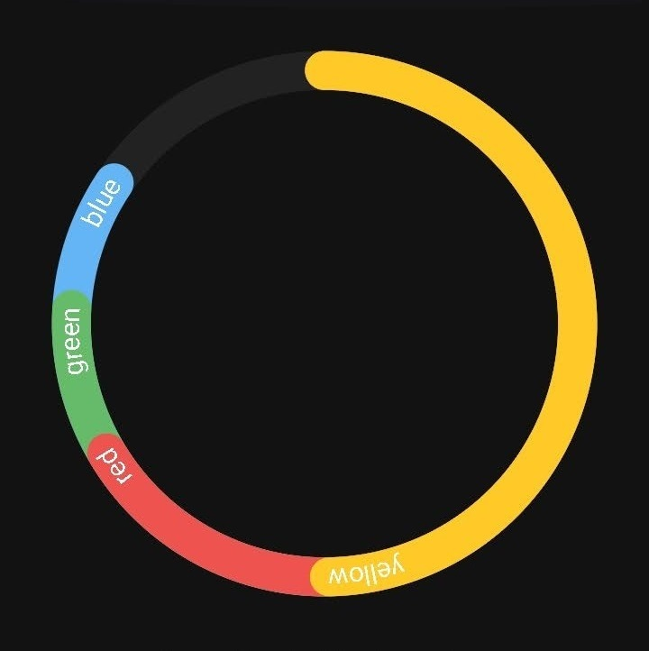

# Ring Chart Library


A Library to create beautiful Ring Charts for your App.
This library supports graceful seamless animations that can be stopped and played at any moment and it continues gracefully.

Checkout Sample App on [Play Store](https://play.google.com/store/apps/details?id=com.taosif7.android.ringchart).

- [Ring Chart Library](#ring-chart-library)
  - [Previews](#previews)
  - [Installation](#installation)
  - [Usage](#usage)
    - [XML View Attributes](#xml-view-attributes)
    - [Initialising Instance](#initialising-instance)
    - [Chart Types](#chart-types)
    - [Adding Data to chart](#adding-data-to-chart)
    - [Updating Data](#updating-data)
    - [Labels](#labels)
    - [Animations](#animations)
  - [License & Copyright](#license--copyright)

<br>
<br>

## Previews

|            |Concentric Mode | Overlap Mode |
|:-----------|:--------------:|:-----------:|
| Light Mode |  |   |
| Dark Mode |  |   |
| Without Labels |  |   |
| Animations |  |   |
| Built to handle lots of data beautifully |  |   |

<br>
<br>

## Installation

Add Jitpack to your project build.gralde file

```java
allprojects {
  repositories {
    ...
    maven { url 'https://jitpack.io' }
  }
}
```

Then add this dependency to your app's build.gradle file.

```java
dependencies {
  ...
  implementation 'com.github.Taosif7:RingChartLib:latest-release'
}
```

<br>
<br>

## Usage

The full usage is implementated in [Sample App](app/src/main/java/com/taosif7/android/ringchart/MainActivity.java).

Add the chart view to your XML file:

```xml
<com.taosif7.android.ringchartlib.RingChart
    android:id="@+id/ring_chart"
    android:layout_width="match_parent"
    android:layout_height="wrap_content"
    app:RingChartSecondaryColor="@color/colorChartBg" />
```

### XML View Attributes

`RingChartPrimaryColor` : Colour to be used for ring in RingChart with only one ring.  
`RingChartSecondaryColor` : Colour to be used for background colour of RingChart.

### Initialising Instance

Firstly reference the RingChart view in your activity and set the chart type

```java
RingChart chart_concentric = findViewById(R.id.ring_chart);

// This method must be called before setting data
my_ringChart.setLayoutMode(RingChart.renderMode.MODE_CONCENTRIC);
```

### Chart Types

The currently supported two types of charts -- Concentric and Overlapping are shown in preview above. these two can be referenced from the enum [`RenderMode`](RingChartLib/src/main/java/com/taosif7/android/ringchartlib/RingChart.java#L513).

### Adding Data to chart

There are two ways to set data:

- For Single Ring  
  This will create a ring chart with single ring and the colour of the
  ring would be the one that is defined in the [`xml view attribute`](#xml-view-attributes) of the view
  
  ```java
  my_ringChart.setData(
  0.77f // A value between 0.0 and 1.0 inclusive
  );
  ```

- For Multiple Rings  
  RingChart accepts List of custom DataType [`RingChartData`](RingChartLib/src/main/java/com/taosif7/android/ringchartlib/models/RingChartData.java) as data points.
  
  ```java
  // Prepare data points
  RingChartData dp_red = new RingChartData(
    0.15f, // Float value between 0.0 and 1.0 inclusive
    ContextCompat.getColor(this, R.color.red), // Resolved colour int
    "RED" // Label to uniquely identify this datapoint
  );
  RingChartData dp_blue = new RingChartData(0.35f, ContextCompat.getColor(this, R.color.blue), "BLUE");
  RingChartData dp_green = new RingChartData(0.65f, ContextCompat.getColor(this, R.color.green), "GREEN");
  RingChartData dp_yellow = new RingChartData(0.85f, ContextCompat.getColor(this, R.color.yellow), "YELLOW");
  
  // Make a list of data points
  ArrayList<RingChartData> data_list = new ArrayList<RingChartData>() {{
    add(dp_red);
    add(dp_blue);
    add(dp_green);
    add(dp_yellow);
  }}; 
    
  // Set data to the instance
  my_ringChart.setData(data_list);
  ```

### Updating Data

There are three ways of update

- Updating single data point
  
  ```java
  my_ringChart.updateItemByLabel(
    "RED", // unique label of the datapoint
    0.2f // value to set
  )
  ```

  This call throws exception if data point with provided label is not present in current data of the chart.

- Updating whole dataset
  
  ```java
  data_list.get(0).value = 0.2f;
  my_ringChart.updateData(data_list);
  ```

  This call throws exception if data point with provided label is not present in current data of the chart.

- Updating data of single-ring ring chart
  
  ```java
  // This will seamlessly update the ring to set the value
  my_ringChart.stopAnimateLoading(0.8);
  ```

### Labels

To show/hide labels, call `showLables(boolean)` on the ringChart Instance

### Animations

- `Start` : To start endless spinning animation, call `startAnimateLoading()` on the RingChart Instance.
- `Stop` To stop the animation seamlessly, call `stopAnimateLoading()` on the RingChart Instance

<br>
<br>

## License & Copyright

© Taosif Jamal 2020

Licensed under the [MIT LICENSE](LICENSE).
